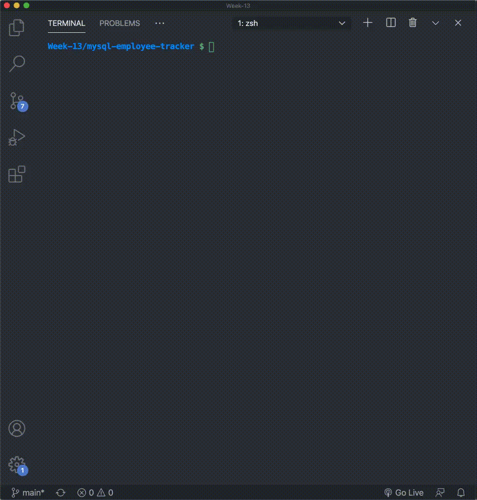

  # mySQL Employee Tracker

  # Table of Contents
  - [Description](#description)
  - [Installation](#installation)
  - [Instructions](#instructions)
  - [Credits](#credits)
  - [Contributions](#contributions)
  - [Tests](#tests)
  - [Questions](#questions)
  - [License](#license)
  ---
  ## Demo of deployed app:
  

  ## Description:
  
  This is a node.js application that uses the inquirer package and mySQL
  to Create, Read, Update and Delete (CRUD) data in a ficticious company database.
  All SQL queries are pre-written, the user only needs to answer the questions
  using the command line interface, and the interation with the database is
  handled in the background.

  Please ensure that you update the connection with your own username, password and port 
  number. 
  
  ---

  ## Installation:
  ### The following are required to run this app:  
  * mySQL Server & Workbench  
  * node.js  
  * node inquirer package  
  * node mySQL package  
  * node dotenv package  

  ---
  ## Instructions:
  1. Fork the repo and run npm install to access the npm dependencies. 
  2. Open the schema.sql in mySQL workbench and proceed to creating the database and tables. 
  3. Seed the database with data by running seed.sql in
  mySQL. 
  4. Return to node and run node index.js to start the application. 
  5. Answer the questions to query the database.

  ---
  ## Credits:
  This work is my own.

  ---
  ## Contributions:
  None.

  ---
  ## Tests:
  None.
  
  ---
  ## Questions:  
  If you have any questions please find my Github username below:  

  * MJ-0001
  

  ---
  ## License:  

  MIT  

    

  https://opensource.org/licenses/MIT
 
  ---